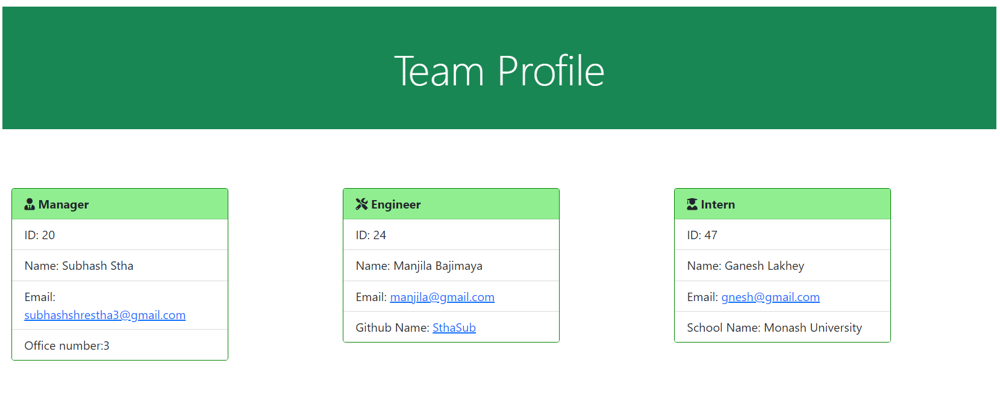

  # Title
  Team Profile Generator
  
  
  
  ## Table of contents 
  - [Description](#description)
  - [Installation](#installation)
  - [Usage Information](#usage-information)
  - [License](#license)
  - [Contribution Guidelines](#contribution-guidelines)
  - [Test Procedure](#test-procedure)
  - [Screenshot](#screenshot)
  - [Questions](#questions)
  
  ## Description
     This application is made up by using js, and html, and it runs through command "node index.js". Promise, Async and await used in index.js file, while classes are defined in other js files including employee, engineer, intern, and manager. The test file of test js is created for each member to test whether each object and function working or not properly. After executing node index.js user needs to give  questions and answers. Lastly, it will generates the unique team html file contaning all information about team  members.  

  ## Installation
     need to perform copying of package.json then run 'npm install' on terminal.

  ## Usage Information
     This application is useful for generating the team information containing different type of member's role, id, name, address. 

  ## License
     MIT license
  
  ## Contribution Guidelines
     N/A

  ## Test Procedure
     needs to run 'npm test' on terminal

  ## Screenshot
  
  
  ## Questions
    if you have questions then please feel free to contact on these addresses,
  Github: [SthaSub](https://github.com/SthaSub)
  
  Email: [subhashshrestha3@gmail.com](subhashshrestha3@gmail.com)
    